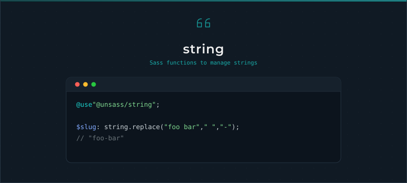

# String

[](https://www.npmjs.com/package/@unsass/string)
[](https://www.npmjs.com/package/@unsass/string)
[](https://www.npmjs.com/package/@unsass/string)

## Introduction

A small, dependency-free Sass toolkit for manipulating strings. Replace, trim, test and combine strings with concise,
composable functions, and keep the Sass built-in `sass:string` functions available under the same namespace.

<div align="center">



</div>

## Installing

```shell
npm install @unsass/string
```

## Usage

```scss
@use "@unsass/string";

$slug: string.replace("foo bar", " ", "-"); // "foo-bar"
```

The module also forwards the Sass built-in [`sass:string`](https://sass-lang.com/documentation/modules/string)
functions, so `string.length()`, `string.slice()` and friends are available through the same namespace.

## Functions

### `replace($string, $query, $replace)`

Replaces every occurrence of a substring. `$replace` defaults to an empty string, which removes the substring.

```scss
@use "@unsass/string";

$replaced: string.replace("The quick brown fox jumps over the lazy dog.", "dog", "monkey");
// "The quick brown fox jumps over the lazy monkey."

$removed: string.replace("foo-bar-baz", "-");
// "foobarbaz"
```

### `to-number($value)`

Converts a string of digits to a number.

```scss
@use "@unsass/string";

$number: string.to-number("42"); // 42
```

### `from-number($value)`

Converts a number to a string.

```scss
@use "@unsass/string";

$string: string.from-number(10); // "10"
```

### `starts-with($string, $substring)`

Checks whether a string starts with a substring.

```scss
@use "@unsass/string";

$result: string.starts-with("button-label", "button"); // true
```

### `ends-with($string, $substring)`

Checks whether a string ends with a substring.

```scss
@use "@unsass/string";

$result: string.ends-with("button-label", "label"); // true
```

### `trim-start($string, $target)`

Removes one leading occurrence of `$target`, which defaults to a whitespace.

```scss
@use "@unsass/string";

$string: string.trim-start("--primary-color", "--"); // "primary-color"
```

### `trim-end($string, $target)`

Removes one trailing occurrence of `$target`, which defaults to a whitespace.

```scss
@use "@unsass/string";

$string: string.trim-end("primary-color--", "--"); // "primary-color"
```

### `trim($string, $start, $end)`

Removes one leading and one trailing occurrence. `$start` defaults to a whitespace, and `$end` defaults to `$start`.

```scss
@use "@unsass/string";

$whitespace: string.trim(" foo "); // "foo"
$custom: string.trim("var(--primary-color)", "var(", ")"); // "--primary-color"
```

### `combine($values…)`

Joins strings with a dash. Falsy values (`null`, `false`) are skipped.

```scss
@use "@unsass/string";

$string: string.combine("button", "label"); // "button-label"
$skipped: string.combine("button", null, "label"); // "button-label"
```
