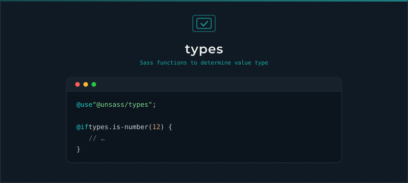

# Types

[](https://www.npmjs.com/package/@unsass/types)
[](https://www.npmjs.com/package/@unsass/types)
[](https://www.npmjs.com/package/@unsass/types)

## Introduction

A small, dependency-free Sass toolkit for checking the type of a value. Each `is-*` function wraps `meta.type-of()` in a
readable predicate, so conditions and input validation stay concise and consistent.

<div align="center">



</div>

## Installing

```shell
npm install @unsass/types
```

## Usage

```scss
@use "@unsass/types";

@if types.is-number(12) {
    // ...
}
```

## Functions

Every function takes a single `$value` and returns a boolean.

### `is-number($value)`

Checks whether a value is a number, with or without unit.

```scss
@use "@unsass/types";

$result: types.is-number(12px); // true
```

### `is-string($value)`

Checks whether a value is a string, quoted or not.

```scss
@use "@unsass/types";

$result: types.is-string("foo"); // true
```

### `is-color($value)`

Checks whether a value is a color.

```scss
@use "@unsass/types";

$result: types.is-color(darkcyan); // true
```

### `is-list($value)`

Checks whether a value is a list.

```scss
@use "@unsass/types";

$result: types.is-list((1px, 2px, 3px)); // true
```

### `is-map($value)`

Checks whether a value is a map.

```scss
@use "@unsass/types";

$result: types.is-map(("foo": "bar")); // true
```

### `is-boolean($value)`

Checks whether a value is `true` or `false`.

```scss
@use "@unsass/types";

$result: types.is-boolean(false); // true
```

### `is-null($value)`

Checks whether a value is `null`.

```scss
@use "@unsass/types";

$result: types.is-null(null); // true
```
