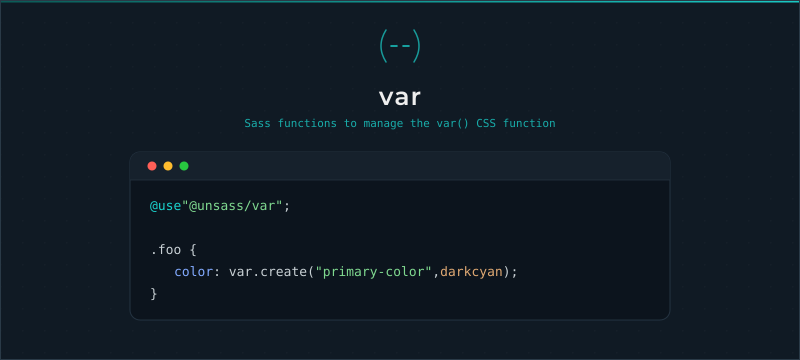

# Var

[](https://www.npmjs.com/package/@unsass/var)
[](https://www.npmjs.com/package/@unsass/var)
[](https://www.npmjs.com/package/@unsass/var)

## Introduction

A small Sass toolkit for working with the `var()` CSS function. Create `var()` calls with an optional fallback, then read
their name and fallback back with concise, composable functions so custom-property logic stays readable and consistent.

<div align="center">



</div>

## Installing

```shell
npm install @unsass/var
```

## Usage

```scss
@use "@unsass/var";

.foo {
    color: var.create("primary-color", darkcyan);
}
```

```css
.foo {
    color: var(--primary-color, darkcyan);
}
```

## Functions

### `create($name, $fallback)`

Creates a `var()` CSS function. The `--` prefix is added to `$name` when missing, and `$fallback` is optional.

```scss
@use "@unsass/var";

.foo {
    color: var.create("primary-color", darkcyan);
    background: var.create("--surface");
}
```

```css
.foo {
    color: var(--primary-color, darkcyan);
    background: var(--surface);
}
```

### `create-name($name)`

Returns the custom property name, prefixed with `--` if missing.

```scss
@use "@unsass/var";

$name: var.create-name("primary-color"); // "--primary-color"
```

### `name($var)`

Returns the name of a `var()` function.

```scss
@use "@unsass/var";

$name: var.name(var(--primary-color, darkcyan)); // "--primary-color"
```

### `fallback($var)`

Returns the fallback of a `var()` function.

```scss
@use "@unsass/var";

$fallback: var.fallback(var(--primary-color, darkcyan)); // "darkcyan"
```

### `parse($var)`

Returns a map with the `name` and `fallback` keys of a `var()` function.

```scss
@use "@unsass/var";

$map: var.parse(var(--primary-color, darkcyan)); // ("name": "--primary-color", "fallback": "darkcyan")
```

`name()`, `fallback()` and `parse()` expect a `var()` function that has a fallback.
